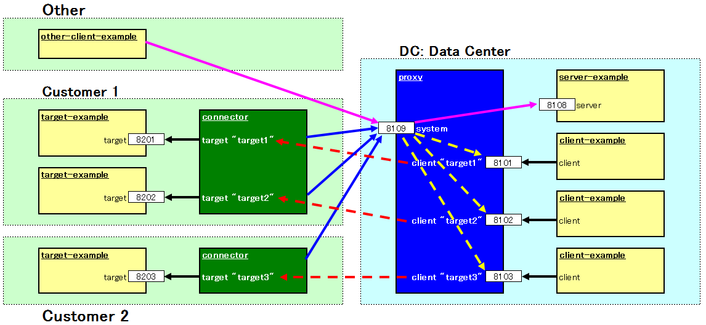

reverse-connector
====

reverse connector.




## Client side: at Data Center

```
$ node proxy
```

proxy-config.json


## Server side: at Customer

```
$ node connector
```

connector-config.json


# LICENSE

  MIT
